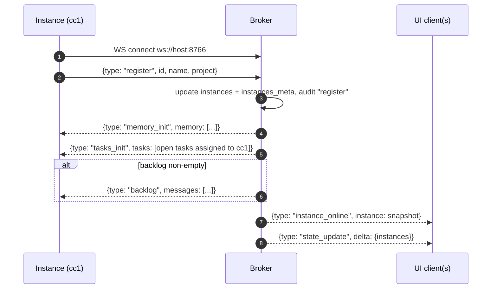
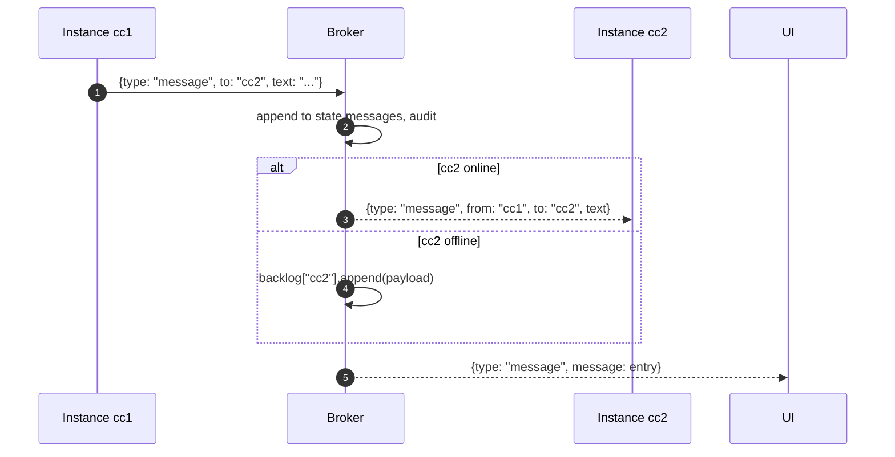
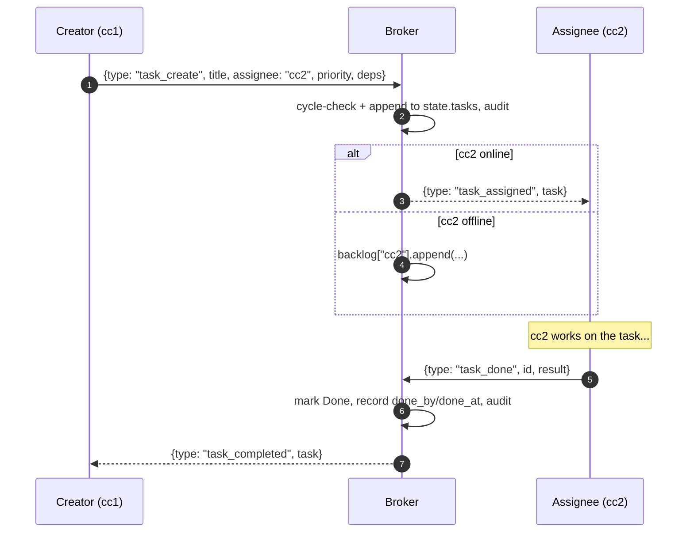
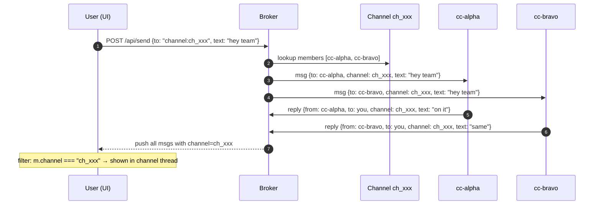

# Architecture

Agent Mesh is a small relay server that lets multiple Claude Code instances and
a human (via the web UI) talk to each other on a local network. There are three
roles in the system:

- **Broker** (`broker.py`) — single process running on the host machine. Owns
  the persisted state and relays messages between everyone else.
- **Instance** (`connect.py`) — a Claude Code session that registers itself
  over a WebSocket and can send/receive messages, status updates, tasks,
  memory writes, and approval requests.
- **UI** (`index.html`) — a browser client that connects to the broker over a
  separate WebSocket. Used by the human operator from a phone or laptop.

```
┌─────────────┐   ws://host:8766   ┌─────────────┐   ws://host:8765/ui   ┌─────────────┐
│  Instance   │ ──────────────────▶│             │◀──────────────────────│     UI      │
│  (cc1)      │                    │   Broker    │                       │ (browser)   │
└─────────────┘                    │  (state.json,│                       └─────────────┘
                                   │   audit log)│
┌─────────────┐   ws://host:8766   │             │   http://host:8765/api/ ┌──────────┐
│  Instance   │ ──────────────────▶│             │◀────────────────────────│   CLI    │
│  (cc2)      │                    └─────────────┘                         │ (curl)   │
└─────────────┘                                                            └──────────┘
```

The broker listens on two ports:

| Port | Protocol | Purpose                                |
|-----:|----------|----------------------------------------|
| 8765 | HTTP     | Serves `index.html`, REST API, UI WS   |
| 8766 | WS       | Instance-to-broker WebSocket           |

Both ports bind `0.0.0.0` so any device on the same LAN can reach them.

## State

The broker's source of truth lives in memory in `Broker.state` and is flushed
to `state.json` after every mutation (debounced by ~0.5s via
`schedule_write`). On startup the broker loads `state.json` and falls back to
an empty state with a `.bak` copy if the file is corrupt.

The state schema (see `empty_state` in `broker.py`):

```python
{
  "messages":  [...],   # all relayed messages
  "tasks":     [...],   # Kanban-style task list
  "memory":    [...],   # shared key/value entries
  "flows":     [...],   # trigger/action rules
  "approvals": [...],   # human-in-the-loop approvals
  "votes":     [...],   # consensus polls
  "audit":     [...],   # append-only audit log (capped at 5000)
  "instances_meta": {}, # persisted per-instance role/paused/name/project
  "counters":  {"M":0,"T":0,"F":0,"AP":0,"V":0,"A":0},
}
```

Instances that are currently disconnected still appear in
`instances_meta` so the sidebar can show their last known role and pause
state. Messages destined for an offline instance go into a per-instance
backlog `deque` (capped at 100) and are flushed on reconnect.

## Sequence diagrams

### Instance registration



The first three init payloads (`memory_init`, `tasks_init`, optional
`backlog`) make registration idempotent and resumable. A re-launched agent
sees everything assigned to it without needing to query.

### Message relay (instance to instance)



The UI always gets a copy so the human sees the relayed traffic in the chat
thread (rendered as `[RELAY] cc1→cc2`).

### Task delegation



If `cc2` reconnects before calling `task_done`, the `tasks_init` payload it
gets at registration includes the open assignment, so it never loses the
hand-off.

### Channel fan-out (server-side groups)

A channel is a named server-side list of members. Sending to
`to: "channel:<id>"` fans out one message per member, each tagged with
`channel=<id>`. Bots that reply preserve the tag, so the UI filter is a
single equality check (`m.channel === channelId`) and historical 1-on-1
messages never leak into the channel thread.



Bot replies inherit the original channel via the bot's `orig_channel`
extraction; agent-to-agent direct messages (no channel) are intentionally
muted to prevent loops, so channels are the canonical path for multi-agent
coordination.

## Concurrency model

The broker runs one asyncio event loop and one `asyncio.Lock` guarding state
mutations. WebSocket handlers are coroutines (`handle_instance`,
`handle_ui_ws`) and REST handlers are aiohttp coroutines. All persistence
writes are scheduled — never inline — so a burst of messages collapses into a
single `state.json` write.

Instance connections use the `websockets` library with `ping_interval=20`
and `ping_timeout=20`. UI connections use aiohttp's built-in WebSocket
server. There is no cross-broker federation — every mesh is a single host.

## File map

| File         | Role                                                      |
|--------------|-----------------------------------------------------------|
| `broker.py`  | All server-side logic: WS handlers, REST, state, audit    |
| `connect.py` | Instance client + background asyncio thread + helpers     |
| `cli.py`     | Thin REST sender (`send`, `status`, `state`, `clear`)     |
| `index.html` | Full single-file UI (chat, kanban, memory, flows, audit)  |
| `state.json` | Persisted state, created on first write                   |
| `tests/`     | pytest suite, runs broker on ports 18765/18766            |
